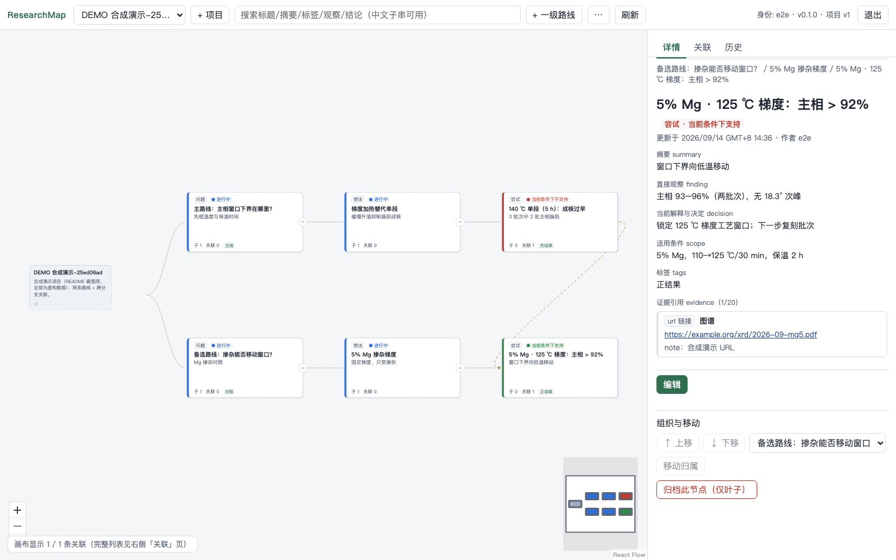

# Ideamify

[English](README.md) · [开始使用](docs/GETTING_STARTED.zh-CN.md) · [AI 协作指南](docs/AI_USAGE.zh-CN.md) · [交流讨论](https://github.com/sugarblock233/Ideamify/discussions)

[](https://github.com/sugarblock233/Ideamify/actions/workflows/ci.yml)
[](LICENSE)

把科研的演进过程留在一张地图里：提出过什么问题、尝试过哪些路线、观察到什么、为什么决定下一步这样做。你的 AI 工具可以读写同一份记录，新会话也能接着上次的研究继续。



## 可以用它做什么

- 用树状结构整理问题、想法、尝试和发现。
- 记录观察、证据和决定，保留负结果及结论成立的条件。
- 连接不同分支的相关工作，查看每次修改的内容和作者。
- 让外部 AI 通过 HTTP API 或 Python CLI 接续研究，版本检查会阻止会话之间静默覆盖记录。
- 用 Docker 在本机运行，数据保存在持久化的 SQLite 卷中。
- 视图与布局（新增）：横向树 / 纵向树 / 大纲列表三种画布布局，折叠与视野按布局分别记忆；一键展开/折叠工具；随缩放自动降档的信息密度（阅读/精简/概览）与低干扰模式；可拖宽、可收起的详情面板；界面中文/English 可切换。

显示名称是 **ResearchMap**。Ideamify 是仓库名，CLI 和 `RESEARCHMAP_*` 配置沿用 ResearchMap 名称。应用本身不调用模型，也不执行实验，适合一位研究者和其信任的 AI 工具共同使用。

## 在本机启动

需要 Git 和带 Compose 的 Docker。在终端执行：

```bash
git clone https://github.com/sugarblock233/Ideamify.git
cd Ideamify
cp .env.example .env
```

编辑 `.env`，把两个令牌占位值换成**不同的长随机值**。可执行两次 `openssl rand -hex 24` 生成。保留 `researcher`、`ai-one` 这两个名字或自行命名；名字会出现在修改历史中。每个有效令牌都能读写这个实例中的所有项目。

```bash
docker compose up -d --build
```

打开 **http://127.0.0.1:8000/**，输入研究者令牌，创建第一个项目。点击 **+ 一级路线** 添加研究路线，再选中节点，通过 **+ 子节点** 记录尝试或后续想法。

接下来按[第一轮科研记录](docs/GETTING_STARTED.zh-CN.md)走一遍，包括如何把记录交给 AI 接续。

## 日常使用

- **离开前保存。** 节点编辑需要手动保存。整页刷新后需重新登录，令牌只保存在页面内存中。
- **AI 写入后**，点击应用内的 **刷新** 或 **载入更新**。如果双方修改了同一个字段，先核对冲突再保存草稿。
- **定期备份。** 重启、重建容器会保留 Compose 数据卷。按[备份、恢复与升级指南](docs/OPERATIONS.zh-CN.md)保护记录。证据路径引用的外部文件还需要单独备份。

v0.1 已进入个人使用和反馈阶段。已发布的 `v0.1.0` 标签是早期版本，`main` 还包含之后的收尾修复，具体见[更新日志](CHANGELOG.md)。后续根据真实使用中的问题迭代。

## 项目资源

- [文档目录](docs/README.md)：使用指南、AI 协议和技术设计
- [参与贡献](CONTRIBUTING.md)：开发环境、检查和 Pull Request 约定
- 用中文或英文[报告问题](https://github.com/sugarblock233/Ideamify/issues/new?template=bug_report.yml)、[提问交流](https://github.com/sugarblock233/Ideamify/discussions)
- [安全说明](SECURITY.md) · [行为准则](CODE_OF_CONDUCT.md) · [MIT 许可证](LICENSE)
