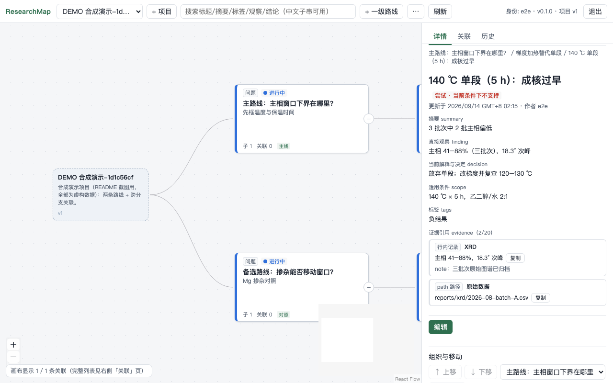

[English](README.md) | [简体中文](README.zh-CN.md)

# Ideamify

> 仓库名为 **Ideamify**；应用与规格目前使用名称 **ResearchMap**。

**一句话定位**：部署在你自己服务器上的轻量 Web 应用，让一位研究者和他信任的
若干 AI 工具**共同维护同一份科研演化地图**——从问题分出路线，记录尝试、观察、
成功、失败与决定；过去的探索（尤其负结果与其成立条件）在换 AI、换设备之后
依然可继承。

适合谁：单个研究者（连同其 AI 辅助终端），想要一份持久的、可审计的、人 + AI
共享的研究记忆，并且部署在自己的服务器上。本项目处于**预发布（0.x）**
阶段：修复勤快但无稳定性承诺，许可证仍在决定中（见文末
[License](#license)）。


_主树画布，1440×900，含跨分支关联。**截图显示的是合成演示数据**，不是真实研究结果。_


_节点详情阅读视图，1280×800（同为合成演示数据）。_

## 核心功能

- **主树 + 跨分支关联。** 每个节点有且只有一个父节点（布局轴）；独立的关联层
  在任意分支之间连线（相关 / 启发 / 支持 / 矛盾 / 依赖），连线按需显示，
  默认不画线。
- **研究状态与证据门槛。** 六种状态，从 `unexplored` 到 `supported` /
  `not_supported`；红/绿**强制**填写适用条件、发现、决定，并至少一条证据——
  由后端校验。红色是「当前条件下不支持」，不是永久证伪。
- **提交历史即审计日志。** 每次变更是一个原子、带作者身份的提交，含
  before/after 差异；任何人可查谁在何时改了什么、为什么，旧版本始终可读。
- **外部 AI 走 API 与 CLI。** 无内置模型：外部 AI 读取预算化的 `context`
  端点，以小增量幂等提交写入，带乐观版本控制（`request_id` +
  `expected_revision`，409 冲突语义）。`tools/researchmap.py` 是只讲 HTTP
  的薄 CLI。
- **导出与备份。** 每项目完整 JSON 导出；基于 SQLite 在线备份的离线
  backup/verify/restore 工具（`tools/backup.py`）。

## 明确不做

- **无内置 LLM**——应用里不存在任何模型调用，也不会去使用你的模型 Key。
- **无自动科研执行**——不做训练/GPU/Slurm 管理、自动读论文、实验编排。
- **模型 API Key 非必需。** 全部核心功能不带 Key 也能用。
- **非多租户。** 不是公开平台：只服务一位研究者的信任圈。
- 同样不在范围内：自由白板、向量/图数据库、多人实时光标、MCP 服务、
  专用移动端布局。完整边界见 [`docs/SPEC.md`](docs/SPEC.md) §0。

## 快速开始

前置：装有 Docker（含 Compose 插件）的机器。

```bash
git clone https://github.com/sugarblock233/Ideamify.git
cd Ideamify
cp .env.example .env
```

编辑 `.env`——设置**两个临时/个人令牌**，各 ≥12 个字符且互不相同（令牌
「名字」会成为提交记录里的 actor 身份）：

```dotenv
RESEARCHMAP_TOKENS={"researcher":"换成研究者的强令牌-0001","ai-one":"换成AI终端的强令牌-0002"}
RESEARCHMAP_PORT=8000
```

然后：

```bash
docker compose up -d --build
```

打开 **http://127.0.0.1:8000/**，用研究者令牌登录。从全新数据库开始，可以
完全在浏览器里：登录 → 创建第一个项目 → 添加一级路线与子节点 → 保存 →
刷新 → 重新登录，内容一致。

### 关键配置

| 变量 | 含义 |
| --- | --- |
| `RESEARCHMAP_TOKENS` | 内联 JSON（或文件路径），映射**名字 → bearer 令牌**。名字就是提交记录里的 actor 身份。令牌请按该实例的根凭据对待——见 [SECURITY.md](SECURITY.md)。 |
| `RESEARCHMAP_PORT` | 宿主机端口（默认 `8000`）。 |

- **默认仅回环。** Compose 发布 `127.0.0.1:$RESEARCHMAP_PORT:8000`——只有
  宿主机可访问。远程访问由部署者自行配置（受保护网络 / HTTPS 反向代理）；
  本项目不会改动你的 SSH、防火墙或隧道。
- **数据位置。** 全部数据在卷 `researchmap-data` 上的单个 SQLite 文件
  （`/data/researchmap.db`）。重启、重建容器不应清空数据。
- **刷新需重新认证。** 令牌只存于浏览器页面内存，刷新页面即退出登录——
  v0.1 有意如此。
- **导出与备份。**

  ```bash
  python3 tools/backup.py backup  --db <db文件> --out ./backup/ --json
  python3 tools/backup.py verify  ./backup/researchmap-<ts>.db
  python3 tools/backup.py restore --src <备份> --dst <目标> --server-stopped --yes
  ```

  备份不含令牌配置，也不包含证据 path 所指向的外部文件；备份副本请另存到
  其他存储位置。

## 外部 AI 如何读写这份地图

完整协议：[`docs/AI_USAGE.md`](docs/AI_USAGE.md)。可直接复制的 commit
模板：[`examples/`](examples/)。最小闭环如下，凭证只走环境变量——
令牌绝不出现在命令行、示例与日志里：

```bash
export RESEARCHMAP_BASE_URL=http://127.0.0.1:8000
export RESEARCHMAP_TOKEN="<你的访问令牌>"     # AI 终端用 ai-one 的令牌

python3 tools/researchmap.py health
python3 tools/researchmap.py context <project_id>           # 预算化的世界状态
python3 tools/researchmap.py commit <project_id> delta.json --dry-run
python3 tools/researchmap.py commit <project_id> delta.json
```

`delta.json` 是一个完整提交请求：自己生成的 `request_id`（UUID）+ 从项目
读到的 `expected_revision`，再加 operations。可复制
[`examples/skeleton.json`](examples/skeleton.json) 修改。

冲突处理（精确语义）：

- **`409 REVISION_CONFLICT`——本次提交未被记录。** 重新读取 context，
  然后**沿用同一个 `request_id`**，用新的 `expected_revision` 重发（错误
  响应里的 `details.current_revision` 会告诉你）。
- **`409 IDEMPOTENCY_KEY_REUSED`**——同一个 `request_id` 已用**不同内容**
  提交过。请换一个全新 UUID。内容完全相同的重复发送是安全的幂等重放
  （`already_committed: true`）。

## 开发与测试

基线工具链：**Python 3.13、Node 22**（与 Docker 镜像和 CI 一致）。

```bash
# 后端
cd backend
python3 -m venv .venv && .venv/bin/pip install -r requirements.txt
RESEARCHMAP_DB=/tmp/rm-dev.db \
RESEARCHMAP_TOKENS='{"dev-researcher":"dev-token-0001","dev-ai":"dev-ai-token-0001"}' \
  .venv/bin/python -m uvicorn app.main:app --host 127.0.0.1 --port 8000

# 前端（另一个终端）
cd frontend
npm ci && npm run dev            # :5173，/api 代理到 :8000
npm test                         # vitest 单测
npm run build                    # tsc --noEmit + 生产构建
npm run build && npx playwright test    # 浏览器 e2e（生产形同源服务）

# 后端测试
cd backend && .venv/bin/python -m pytest tests -q

# 可选合成压测（自带 scratch 服务，安全）
python3 scripts/stress_test.py
```

开发/测试请使用 scratch 数据库（`/tmp/...`），绝不使用 `data/` 或部署卷。
`backend/requirements.lock.txt` 是 Docker 与 CI 使用的完整传递依赖锁；
开发 venv 使用 `requirements.txt`。

## 文档导航

| 文件 | 内容 |
| --- | --- |
| [`docs/SPEC.md`](docs/SPEC.md) | 产品与技术规格——产品语义的权威来源 |
| [`docs/DECISIONS.md`](docs/DECISIONS.md) | 规格未规定处的实现决策 |
| [`docs/AI_USAGE.md`](docs/AI_USAGE.md) | 外部 AI 协议（读取 → dry-run → 提交 → 冲突 → 交接） |
| [`docs/QWEN_EXECUTION_PLAN.md`](docs/QWEN_EXECUTION_PLAN.md) | 当前修复/治理批次的执行计划（A/B/D/G 项；G10 = 所有者决定项） |
| [`docs/implementation-results.md`](docs/implementation-results.md) | 逐项执行证据与剩余限制 |
| [`examples/`](examples/) | 明确标注 synthetic 的提交请求模板 |
| [`scripts/`](scripts/) | 压测脚本 |

> 注意：`docs/QWEN_EXECUTION_PLAN.md` 与 `docs/acceptance-2026-09-13/`
> 暂含本地开发路径；公开前会先出脱敏版本。

## 贡献、反馈与支持

- [CONTRIBUTING.md](CONTRIBUTING.md)——开发安装、提交/PR 约定、测试矩阵、
  语言政策、数据与凭证规则。
- [AGENTS.md](AGENTS.md)——AI agent 在本仓库的操作规则。
- [CODE_OF_CONDUCT.md](CODE_OF_CONDUCT.md)——参与规范。
- Issue：使用提供的模板（英文或中文均可）。安全相关请走
  [SECURITY.md](SECURITY.md)，不要开公开 Issue。
- 无邮件列表/IRC：单维护者项目，issue 与 Release notes 是主要渠道。

## 已知限制（诚实清单）

- **预发布 0.x**：API/CLI/schema 可能变化，见 [CHANGELOG.md](CHANGELOG.md)
  的版本说明。
- **远端 CI 尚未经过运行**：`.github/workflows/ci.yml` 已配置并与本地工具链
  对齐，但截至本提交尚未在 GitHub 上执行过。
- **容器路径未在本机复验**：本开发机没有 Docker；`Dockerfile` +
  `compose.yaml` 已编写并评审，container CI job 正是为证明它而设——在首次
  远端 CI 通过之前，请视镜像路径为**已配置、尚未本机验证**。
- 本地文档含路径问题（见上文导航注记）。
- 尚无 License（见下）。

## 路线图（已记录的暂缓项）

以下不承诺、也不构成 v0.2 计划；仅把项目已记录的暂缓清单原文保留在此，
防止范围悄悄扩张（`docs/QWEN_EXECUTION_PLAN.md` §10）。v0.2 的具体想法
待所有者排定优先级后再补充。

- 明确不做：自动发布 npm/PyPI 包、复杂分支模型、CLA 系统、维护者组织权限、
  自动关闭 Issue 的机器人、自动合并全部依赖升级、GitHub Pages 文档站、
  公开在线演示站、付费代码质量平台、全量 UI 国际化、CITATION.cff/DOI 自动
  发布、复杂自动发版或多平台镜像矩阵。

## License

**待定——本仓库当前尚未包含 LICENSE 文件。** 所有者正在决定许可证
（见 `docs/QWEN_EXECUTION_PLAN.md` G10；候选 MIT 或 Apache-2.0）。在
LICENSE 发布之前，代码视为**未授权**：适用默认本地版权，本仓库不授予任何
使用、复制或修改许可。在所有者决定前，请勿添加许可证徽章。